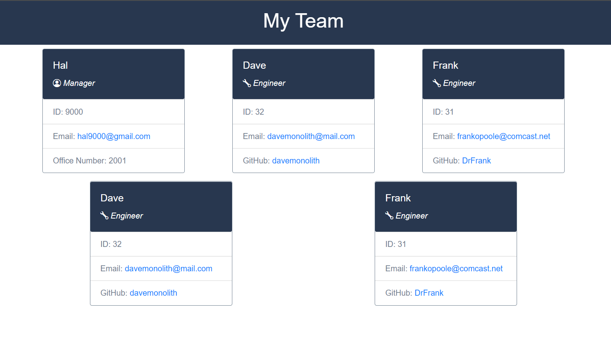

# Team Profile Generator

## Description

This application uses a [Node.js](https://nodejs.org/en/about/) command-line program that takes in information about employees on a software engineering team and generates an HTML webpage that displays summaries for each person.

The implementation uses [Jest](https://www.npmjs.com/package/jest) in order to follow good Test-Driven Development practices. This project also uses the npm [inquirer.js](https://www.npmjs.com/package/inquirer) package to present the user with prompts to fill-out the information for each employee.

This project takes the input provided by [inquirer.js](https://www.npmjs.com/package/inquirer) and transforms it to class objects that are then processed to dynamically create HTML code.

Some other concepts implemented througout this application are [Object-oriented programming (OOP)](https://en.wikipedia.org/wiki/Object-oriented_programming), [Test-driven development (TDD)](https://en.wikipedia.org/wiki/Test-driven_development).

## User Story

```
AS A manager
I WANT to generate a webpage that displays my team's basic info
SO THAT I have quick access to their emails and GitHub profiles
```

## Acceptance Criteria

```
GIVEN a command-line application that accepts user input
WHEN I am prompted for my team members and their information
THEN an HTML file is generated that displays a nicely formatted team roster based on user input
WHEN I click on an email address in the HTML
THEN my default email program opens and populates the TO field of the email with the address
WHEN I click on the GitHub username
THEN that GitHub profile opens in a new tab
WHEN I start the application
THEN I am prompted to enter the team manager’s name, employee ID, email address, and office number
WHEN I enter the team manager’s name, employee ID, email address, and office number
THEN I am presented with a menu with the option to add an engineer or an intern or to finish building my team
WHEN I select the engineer option
THEN I am prompted to enter the engineer’s name, ID, email, and GitHub username, and I am taken back to the menu
WHEN I select the intern option
THEN I am prompted to enter the intern’s name, ID, email, and school, and I am taken back to the menu
WHEN I decide to finish building my team
THEN I exit the application, and the HTML is generated
```

## Application Output Examples

### Genrerated HTML Output:



### Walkthrough Video:

This video depicts how [Jest](https://www.npmjs.com/package/jest) test cases are invoked from the command line and all of them pass, then launches the application from the command line, shows every [inquirer.js](https://www.npmjs.com/package/inquirer) prompt, and ends creating a HTML file in the **./dist** folder.

By running the extension [Live Server](https://marketplace.visualstudio.com/items?itemName=ritwickdey.LiveServer), it shows the final product in the browser. Clicking on the email link will launch the local email client and fills out the TO: address field. Also, clicking on the GitHub username will open up a new browser tab to the GitHub profile page.

## Project URLs

-  The URL of the deployed application:
   https://joseepina.github.io/team-profile-generator

-  The URL of the GitHub repository:
   https://github.com/JoseEPina/team-profile-generator
